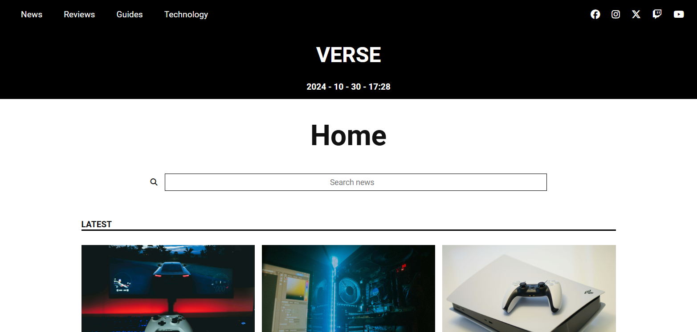

# Description

Online Magazine about Games and Technology is a **responsive web project** designed to provide users with an engaging and adaptable browsing experience across devices. The site 
features a dynamic **search bar powered by JSON**, where data like headlines and images are stored, allowing for efficient content retrieval. By simply entering a keyword in the 
search bar, users can quickly access relevant articles and discover new content. Media queries are extensively used to create a seamless design that adjusts to various screen 
sizes, ensuring accessibility and readability for all users.

# Main Features
- HTML and CSS
- JavaScript
- Search bar with JSON
- Responsive Design

# Screenshot

